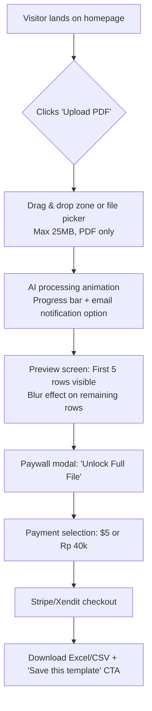
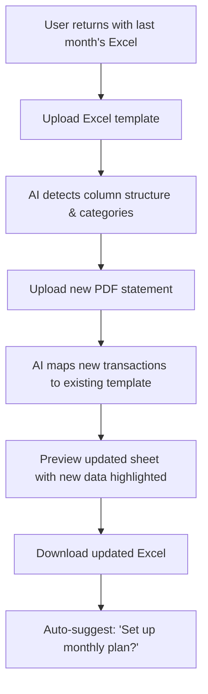
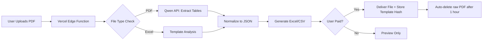

# **PRODUCT REQUIREMENTS DOCUMENT**

**Project Codename:** StatementSheet (Final name TBD)  
**Version:** 1.0  
**Date:** December 10, 2025  
**Author:** VP of Product  
**Status:** ✅ Approved for 30-day MVP execution

---

## **1. EXECUTIVE SUMMARY**

**Mission:** Build a privacy-first bank statement converter that uses AI to turn PDFs into Excel/CSV in 10 seconds, with a unique continuity feature that remembers user templates month-to-month.  
**Why Now:** 42% of SMBs still manually copy bank data into spreadsheets (Forrester 2024). No tool solves the "next month problem" where users must recreate categories/formats.  
**30-Day Goal:** 100 paid users or kill. CAC ≤ $4 (global) / ≤ Rp 12k (ID).

**🚫 SCOPE CREEP POLICE:**

- NO user accounts (email-only for delivery)
- NO bank-specific parsers (AI handles all formats)
- NO mobile app (PWA only)
- NO accounting integrations (pure Excel/CSV output)

---

## **2. CORE USER FLOWS**

### **Flow 1: First-Time User (PDF → Excel)**



### **Flow 2: Returning User (Excel Continuity)**



---

## **3. TECHNICAL ARCHITECTURE**

### **Stack (Optimized for Speed)**

| Component      | Technology                          | Why                                        |
| -------------- | ----------------------------------- | ------------------------------------------ |
| **Frontend**   | Next.js 14 (App Router) + Shadcn UI | SEO-friendly, built-in PWA support         |
| **Styling**    | Tailwind CSS + custom green palette | Rapid theming, consistent breakpoints      |
| **Hosting**    | Vercel Pro ($20/mo)                 | Edge functions, preview branches           |
| **Backend**    | Supabase (PostgreSQL)               | Row-level security, free tier for 50k rows |
| **AI Parsing** | Qwen API + fallback to GPT-4o       | Cost: $0.0008/page vs $0.15 for Textract   |
| **Queue**      | Upstash Redis (BullMQ)              | Rate limiting, job retries                 |
| **Payments**   | Stripe (global) + Xendit (ID)       | Unified webhook handler                    |
| **Analytics**  | Plausible.io ($9/mo)                | Privacy-compliant tracking                 |

### **Data Flow Diagram**



### **Critical Security Rules**

1. **Raw PDFs**: Stored temporarily in Vercel Edge Function memory, never written to disk
2. **User Data**: Only store template hashes (SHA-256) and anonymized transaction counts
3. **Compliance**: GDPR/CCPA right-to-delete implemented via cron job (daily purge)
4. **Encryption**: All webhook payloads signed with HMAC-SHA256

---

## **4. UI/UX SPECIFICATIONS**

**🎨 Color System (Modern Money Green)**

```css
:root {
  --primary-50: #f0fdf4; /* Background tint */
  --primary-100: #dcfce7; /* Hover states */
  --primary-300: #86efac; /* Progress bars */
  --primary-500: #22c55e; /* Primary buttons */
  --primary-700: #15803d; /* Dark buttons */
  --gray-100: #f9fafb; /* Card backgrounds */
  --gray-300: #d1d5db; /* Borders */
  --gray-900: #111827; /* Text */
}
```

### **Page 1: Homepage/Landing (Pre-Sell Mode)**

![Homepage wireframe description]

- **Hero Section**:

  - Left: "Stop copying bank statements by hand. Get Excel files in 10 seconds."
  - Right: Animated mockup showing PDF → Excel conversion (Lottie animation)
  - CTA Button: "Reserve Early Access - Pay $5 Now" (primary green)
  - Subtext: "First 100 users get lifetime 30% discount. Pay today, use when ready."

- **Demo Video Section**:

  - 45-second silent video showing:
    1. Drag PDF → instant processing animation
    2. Preview with blurred rows
    3. Payment modal ($5 unlock)
    4. Next month: Upload same Excel + new PDF → auto-filled sheet
  - Caption: "No accounts. No storage. Just your data in your format."

- **Pricing Table**:  
  | Plan | Global | Indonesia |
  |------|--------|-----------|
  | **Early Bird** | $5/month | Rp 40k/month |
  | **Features** | Unlimited PDFs, Template continuity, Email support | Same + WhatsApp delivery |
  | **Normal Price** | $7/month | Rp 50k/month |

- **Trust Badges**:
  - "Files deleted after 1 hour" icon
  - "SOC 2 compliant infrastructure" badge (Vercel/Supabase)
  - "No raw PDFs stored" lock icon

### **Page 2: Upload Flow (Post-Purchase)**

- **Upload Zone**:

  - Drag & drop area with dashed border (primary-300 when active)
  - Text: "Drag PDF or Excel template here (max 25MB)"
  - Secondary button: "Browse files"

- **Processing State**:

  - Animated progress bar (primary-500 gradient)
  - Status text: "Reading your Chase statement..."
  - "Email me when ready" checkbox (pre-filled from payment email)

- **Preview Screen**:
  - Table showing first 5 rows (clear text)
  - Rows 6+ blurred with overlay: "Pay $5 to unlock all 142 transactions"
  - Visual indicator: "✅ 98% confidence score" (green badge)
  - Secondary CTA: "Try another file" (if parsing failed)

### **Page 3: Success/Download**

- **File Delivery**:

  - Green checkmark animation + "Your file is ready!"
  - Two download buttons: "Download Excel" (primary) / "Download CSV" (secondary)
  - **Continuity CTA**: "Save this template! Next month, upload this Excel + new PDF to auto-fill categories."
  - Preview of template structure (columns detected: Date, Description, Amount)

- **Post-Download Flow**:
  - If user uploaded PDF: "Set up monthly plan? $5/month for unlimited files"
  - If user uploaded Excel template: "You're all set! Come back next month with your new statement."
  - Referral section: "Give a friend 1 free file → get 1 free file yourself"

---

## **5. LAUNCH & VALIDATION STRATEGY**

### **Pre-Launch (Days 1-3): Validation Sprint**

**Goal:** Get 15 pre-paid commitments before writing parser code

- **Landing Page**: Vercel-hosted Next.js app with Stripe/Xendit pre-checkout
- **Ad Strategy ($50 total budget)**:  
  | Channel | Budget | Targeting | Success Metric |  
  |---------|--------|-----------|----------------|  
  | Google Search | $20 | "convert bank statement to excel", "PDF to Excel accounting" | $1.33 CAC (15 users) |  
  | Reddit | $0 | r/Bookkeeping (follow rules), r/smallbusiness | 5+ DMs asking "when launch?" |  
  | WhatsApp | $0 | Forward to 3 Indonesian SME groups | 3+ voice messages requesting access |  
  | LinkedIn | $30 | "freelance bookkeeper", "loan officer", "SMB finance manager" | 10+ clicks to payment page |

- **Kill Criteria (Day 4)**:
  - ❌ < 15 pre-paid users → pivot pricing or kill project
  - ✅ ≥ 15 pre-paid users → proceed to MVP build

### **MVP Build (Days 5-21)**

| Day   | Deliverable                                              | Owner                       |
| ----- | -------------------------------------------------------- | --------------------------- |
| 5-7   | Core upload → AI parsing → Excel generation              | Engineering                 |
| 8-10  | Payment integration + webhook handlers                   | Engineering                 |
| 11-14 | Continuity feature (Excel template matching)             | Engineering + AI specialist |
| 15-18 | Admin dashboard (monitor accuracy, manual fixes)         | Engineering                 |
| 19-21 | Beta test with 15 pre-paid users (manual parsing backup) | Product + Support           |

### **Launch (Days 22-30)**

- **Day 22**: Release to pre-paid users + Product Hunt launch
- **Day 24**: Indonesian FB/WhatsApp group blast (Rp 40k pricing)
- **Day 26**: Cold email to 50 loan brokers (personalized video demo)
- **Day 28**: Review metrics against kill criteria:
  - Global CAC ≤ $4?
  - ID CAC ≤ Rp 12k?
  - > 25% of users use continuity feature?
- **Day 30**: Go/No-Go decision meeting

---

## **6. KILL/PIVOT CRITERIA**

**🚨 HARD STOP CONDITIONS (Day 30 Review):**

1. **Economics Failure**:
   - Global CAC > $6 OR ID CAC > Rp 15k after $100 ad spend
   - Gross margin < 80% (after payment fees + AI costs)
2. **Product Failure**:
   - Parse accuracy < 95% on 3 real user files
   - <10% of users attempt continuity feature
3. **Market Failure**:
   - <50 total paid users
   - Churn > 40% in first 15 days of active users

**🔄 PIVOT OPTIONS IF PARTIALLY SUCCESSFUL:**

- **Pivot A (Global Focus)**: Become "Chase-only statement tool for US real estate agents"
- **Pivot B (ID Focus)**: "WhatsApp-first statement parser for Indonesian warungs" with Rp 5k/file pricing
- **Pivot C (API Play)**: Sell parsing engine to accounting software via API ($0.01/call)

---

## **7. RISKS & MITIGATIONS**

| Risk                                       | Probability | Impact   | Mitigation                                                                   |
| ------------------------------------------ | ----------- | -------- | ---------------------------------------------------------------------------- |
| AI parsing fails on handwritten statements | Medium      | High     | Manual fallback: "Email us, we'll process within 30 min" (limit 20/day)      |
| Payment fraud (stolen cards)               | Low         | Critical | Stripe Radar + Xendit fraud scoring; manual review for first 50 transactions |
| Copycat launches during 30-day sprint      | High        | Medium   | File provisional patent for continuity algorithm; build affiliate army       |
| Data deletion compliance failure           | Low         | Critical | Automated Supabase cron job + third-party audit ($500 one-time)              |

---

## **8. SUCCESS METRICS**

**North Star:** **$5 CAC** with **90%+ gross margin**

- **Primary**:
  - 100 paid users by Day 30
  - 15% of free users convert to paid within 7 days
- **Secondary**:
  - 40% of paid users use continuity feature monthly
  - <0.5% files require manual processing
- **Guardrail**:
  - 100% raw PDFs deleted within 1 hour of processing

---

**NEXT STEPS:**  
✅ **Today**: Engineer starts Vercel/Supabase setup + landing page  
✅ **Tomorrow**: Run $50 validation ads (Google/LinkedIn/WhatsApp)  
✅ **Day 3 EOD**: Review pre-sales → green light full build

**This PRD is locked.** Any change requests require VP Product approval with explicit trade-offs (e.g., "Add user accounts → +7 days dev time → push launch to Day 37").

**Time to ship.** I'll monitor the validation dashboard hourly. Tag me when the first pre-sale comes in. 💚