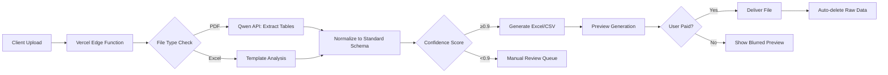

# **BACKEND API TECHNICAL SPECIFICATION**

**Project:** StatementSheet MVP  
**Version:** 1.0  
**Target:** AI Code Agent Implementation  
**Deadline:** 30-day sprint (December 10, 2025)

---

## **CORE PRINCIPLES**

✅ **ZERO RAW PDF STORAGE** - Process entirely in-memory, delete after 1 hour  
✅ **PRIVACY BY DEFAULT** - Store ONLY template hashes and anonymized metadata  
✅ **COST CONTROL** - Max $0.10/file processing cost (AI + infrastructure)  
✅ **IDEMPOTENCY** - All payment/webhook operations must be idempotent

---

## **1. SYSTEM ARCHITECTURE**

### **Tech Stack Requirements**

| Component      | Technology                   | Version | Configuration                           |
| -------------- | ---------------------------- | ------- | --------------------------------------- |
| **Runtime**    | Next.js Edge Functions       | 14.2+   | `runtime: 'edge'`                       |
| **Database**   | Supabase PostgreSQL          | Latest  | Row Level Security enabled              |
| **Queue**      | Upstash Redis (BullMQ)       | v4.0+   | 100 retries max, exponential backoff    |
| **AI Service** | Qwen API                     | Latest  | Fallback to GPT-4o if confidence < 0.85 |
| **Payments**   | Stripe SDK + Xendit Node SDK | Latest  | Webhook secret verification             |

### **Data Flow Diagram**



---

## **2. API ENDPOINT SPECIFICATIONS**

### **Endpoint 1: File Upload (POST `/api/upload`)**

**Method:** POST  
**Content-Type:** multipart/form-data  
**Request Parameters:**

```json
{
  "file": "Binary file (PDF/Excel only, max 25MB)",
  "email": "string (optional, for notification)"
}
```

**Validation Rules:**

- ❌ Reject if file size > 25MB → HTTP 413
- ❌ Reject if not PDF/Excel mime type → HTTP 400
  - Valid types: `application/pdf`, `application/vnd.ms-excel`, `application/vnd.openxmlformats-officedocument.spreadsheetml.sheet`
- ❌ Reject if encrypted/password-protected PDF → HTTP 422

**Response (Success - HTTP 202):**

```json
{
  "jobId": "job_1702219845_abc123",
  "status": "processing",
  "estimatedTime": 15,
  "previewUrl": "/preview/job_1702219845_abc123"
}
```

**Response (Error - HTTP 4xx/5xx):**

```json
{
  "error": "FILE_TOO_LARGE",
  "message": "File exceeds 25MB limit",
  "maxSize": 26214400
}
```

**Critical Implementation Notes:**

- Process file entirely in Edge Function memory (no disk writes)
- Generate unique jobId using: `job_${Date.now()}_${crypto.randomUUID().slice(0,8)}`
- Immediately queue processing job using Upstash Redis

---

### **Endpoint 2: Preview Generation (GET `/api/preview/{jobId}`)**

**Method:** GET  
**Authentication:** None (public preview)  
**Response (Success - HTTP 200):**

```json
{
  "jobId": "job_1702219845_abc123",
  "status": "completed",
  "preview": {
    "columns": ["date", "description", "debit", "credit", "balance"],
    "rows": [
      {
        "date": "2024-12-01",
        "description": "STARBUCKS #123",
        "debit": 8.5,
        "credit": 0,
        "balance": 1245.3
      },
      {
        "date": "2024-12-01",
        "description": "GROCERY STORE",
        "debit": 42.15,
        "credit": 0,
        "balance": 1203.15
      },
      // ... first 5 rows only
      { "blurred": true, "message": "Pay to unlock all 142 transactions" }
    ],
    "confidenceScore": 0.96,
    "fileType": "application/pdf",
    "detectedBank": "Chase"
  },
  "unlockUrl": "/checkout?jobId=job_1702219845_abc123"
}
```

**Response (Processing - HTTP 202):**

```json
{
  "status": "processing",
  "progress": 65,
  "estimatedSecondsRemaining": 8
}
```

**Critical Implementation Notes:**

- Show maximum 5 rows in preview (blur remaining rows client-side)
- Include confidence score from AI parsing (0.0-1.0)
- If confidence < 0.85, add `"warning": "Low confidence - manual review may be needed"`

---

### **Endpoint 3: Payment Checkout (POST `/api/checkout`)**

**Method:** POST  
**Request Body:**

```json
{
  "jobId": "job_1702219845_abc123",
  "currency": "usd|idr",
  "email": "user@example.com"
}
```

**Response (Success - HTTP 200):**

```json
{
  "paymentProvider": "stripe|xendit",
  "checkoutUrl": "https://checkout.stripe.com/pay/cs_test_a1b2c3...",
  "expiresAt": "2024-12-10T15:30:00Z"
}
```

**Critical Implementation Logic:**

```typescript
// Payment routing logic
function getPaymentProvider(currency: string): "stripe" | "xendit" {
  const country = detectUserCountry(); // From IP geolocation
  if (currency === "idr" || country === "ID") return "xendit";
  return "stripe";
}

// Pricing rules
const PRICING = {
  usd: { single: 5.0, monthly: 7.0 },
  idr: { single: 40000, monthly: 50000 },
};
```

**Security Requirements:**

- Validate jobId exists and status = "completed"
- Verify email format before creating payment session
- All webhook endpoints must verify signatures:

  ```typescript
  // Stripe webhook verification
  const sig = req.headers["stripe-signature"];
  stripe.webhooks.constructEvent(body, sig, process.env.STRIPE_WEBHOOK_SECRET);

  // Xendit webhook verification
  const xenditSignature = req.headers["x-callback-signature"];
  verifyXenditSignature(
    body,
    xenditSignature,
    process.env.XENDIT_WEBHOOK_SECRET
  );
  ```

---

### **Endpoint 4: File Download (GET `/api/download/{jobId}`)**

**Method:** GET  
**Authentication:** Payment verification via JWT  
**Response (Success - HTTP 200):**

- Headers: `Content-Type: application/vnd.openxmlformats-officedocument.spreadsheetml.sheet`
- Body: Binary Excel file

**Response (Unauthorized - HTTP 403):**

```json
{
  "error": "PAYMENT_REQUIRED",
  "message": "Payment required to access this file",
  "unlockUrl": "/checkout?jobId=job_1702219845_abc123"
}
```

**Critical Implementation Notes:**

- Verify payment status in Supabase before serving file
- Generate Excel file dynamically using `exceljs` library
- Include template continuity metadata in Excel properties:
  ```typescript
  workbook.properties = {
    custom: {
      templateHash: generateFileHash(buffer),
      lastProcessed: new Date().toISOString(),
    },
  };
  ```

---

## **3. BACKGROUND PROCESSING SYSTEM**

### **Queue Configuration (Upstash Redis)**

**Queue Name:** `statement-processing`  
**Job Schema:**

```typescript
interface ProcessingJob {
  jobId: string;
  fileType: "pdf" | "excel";
  fileBuffer: Buffer; // Base64 encoded
  fileName: string;
  userEmail?: string;
  createdAt: Date;
}
```

**Retry Policy:**

- Max attempts: 3
- Backoff: Exponential (1s, 2s, 4s)
- Failure handling: Move to `manual-review` queue after 3 failures

### **AI Parsing Pipeline**

**Step 1: File Analysis**

```typescript
async function analyzeFile(buffer: Buffer, fileType: string) {
  if (fileType === "application/pdf") {
    return await extractPDFTables(buffer); // Uses pdf-lib + text extraction
  } else {
    return await analyzeExcelTemplate(buffer); // Uses exceljs
  }
}
```

**Step 2: AI Normalization (Qwen API)**  
**System Prompt:**

```
You are a bank statement parser. Output ONLY valid JSON with this structure:
{
  "bank_name": "string",
  "statement_period": "YYYY-MM-DD to YYYY-MM-DD",
  "transactions": [
    {"date": "YYYY-MM-DD", "description": "string", "debit": number|null, "credit": number|null, "balance": number}
  ],
  "confidence_score": 0.0-1.0,
  "warnings": ["array", "of", "warnings"]
}
Rules:
1. Debit = money leaving account (positive number)
2. Credit = money entering account (positive number)
3. Balance = running balance after transaction
4. If amount is unclear, set confidence_score < 0.8
5. Never invent data - if uncertain, set confidence_score low
```

**Step 3: Fallback Logic**

```typescript
async function parseWithFallback(rawData: string): Promise<ParsedStatement> {
  try {
    // Primary: Qwen API
    const result = await qwen.parse(rawData);
    if (result.confidence_score >= 0.85) return result;
  } catch (error) {
    console.warn("Qwen API failed:", error);
  }

  try {
    // Fallback 1: GPT-4o
    const result = await openai.parse(rawData);
    if (result.confidence_score >= 0.8) return result;
  } catch (error) {
    console.warn("GPT-4o failed:", error);
  }

  // Fallback 2: Manual review queue
  await addToManualReviewQueue(rawData);
  throw new Error("Low confidence - requires manual review");
}
```

---

## **4. DATA RETENTION & PRIVACY**

### **Auto-Deletion Rules**

**Raw Files:**

- Delete from memory immediately after processing
- Zero persistent storage of raw PDFs/Excel files

**Processed Data:**  
| Data Type | Retention Period | Storage Location |  
|-----------|------------------|------------------|  
| Job metadata | 30 days | Supabase `processing_jobs` |  
| Template hashes | 90 days (or until user deletes) | Supabase `templates` |  
| Payment records | 7 years (legal requirement) | Stripe/Xendit (not in our DB) |  
| User emails | Until user requests deletion | Supabase `payments` (anonymized after 90 days) |

**Deletion Cron Job (Daily):**

```sql
-- Delete raw job data after 1 hour
DELETE FROM processing_jobs
WHERE created_at < NOW() - INTERVAL '1 hour'
AND status = 'completed';

-- Anonymize emails after 90 days
UPDATE payments
SET email = 'user_' || MD5(user_id) || '@deleted.com'
WHERE created_at < NOW() - INTERVAL '90 days';
```

### **GDPR/CCPA Compliance**

- **Right to deletion endpoint:** `DELETE /api/user-data?email=user@example.com`
- **Data portability:** `GET /api/export?email=user@example.com` returns all user data in JSON
- **Automatic deletion:** All personal data removed within 24 hours of request

---

## **5. ERROR HANDLING & MONITORING**

### **Standard Error Codes**

| Code               | HTTP Status | Meaning              | Retryable          |
| ------------------ | ----------- | -------------------- | ------------------ |
| FILE_TOO_LARGE     | 413         | >25MB file           | No                 |
| INVALID_FILE_TYPE  | 400         | Not PDF/Excel        | No                 |
| PROCESSING_TIMEOUT | 504         | >60s processing time | Yes (with backoff) |
| AI_PARSE_FAILURE   | 500         | AI confidence < 0.7  | No (manual review) |
| PAYMENT_FAILED     | 402         | Payment declined     | Yes                |

### **Monitoring Requirements**

**Critical Alerts (Slack webhook):**

- [ ] Job queue > 10 items waiting
- [ ] AI parsing success rate < 90% for 5 consecutive jobs
- [ ] Payment webhook failures > 3 in 1 hour
- [ ] Raw file storage detected (security breach)

**Daily Reports:**

- Processing success rate (%)
- Average processing time (seconds)
- Cost per file (AI + infrastructure)
- Revenue vs. costs (unit economics)

---

## **6. ENVIRONMENT VARIABLES**

```env
# REQUIRED
NEXT_PUBLIC_URL=https://statementsheet.vercel.app
QWEN_API_KEY=sk-xxxx
OPENAI_API_KEY=sk-xxxx
STRIPE_SECRET_KEY=sk_test_xxxx
STRIPE_WEBHOOK_SECRET=whsec_xxxx
XENDIT_API_KEY=xxxx
XENDIT_WEBHOOK_SECRET=xxxx
SUPABASE_URL=xxxx
SUPABASE_SERVICE_ROLE_KEY=xxxx
UPSTASH_REDIS_URL=xxxx
UPSTASH_REDIS_TOKEN=xxxx

# OPTIONAL (defaults provided)
MAX_FILE_SIZE=26214400  # 25MB
PROCESSING_TIMEOUT=60  # seconds
AI_CONFIDENCE_THRESHOLD=0.85
```

---

## **7. IMPLEMENTATION PRIORITIES (Day-by-Day)**

| Day   | Task                 | Acceptance Criteria                                                            |
| ----- | -------------------- | ------------------------------------------------------------------------------ |
| **1** | File upload endpoint | Accepts PDF/Excel <25MB, returns jobId, validates file types                   |
| **2** | Privacy guard system | Zero raw files in DB after processing, auto-deletion cron job                  |
| **3** | Qwen API integration | Processes sample Chase PDF, returns normalized JSON with >0.9 confidence       |
| **4** | Template detection   | Analyzes Excel file, detects column structure, stores template hash only       |
| **5** | Payment system       | Creates Stripe/Xendit checkout sessions based on currency, handles webhooks    |
| **6** | Download endpoint    | Serves Excel files only after payment verification, includes template metadata |
| **7** | End-to-end test      | Full flow: Upload → Process → Preview → Pay → Download (all <30 seconds)       |

---

## **8. KILL SWITCHES (Critical Safety Nets)**

```typescript
// lib/kill-switches.ts
export function shouldProcessFile(job: ProcessingJob): boolean {
  // Emergency stop if costs exceed threshold
  if (getDailyCost() > 50) {
    sendAlert("DAILY_COST_EXCEEDED", `${getDailyCost()} > $50`);
    return false;
  }

  // Stop if error rate too high
  if (getErrorRate("last_hour") > 0.3) {
    sendAlert(
      "HIGH_ERROR_RATE",
      `${getErrorRate("last_hour") * 100}% failure rate`
    );
    return false;
  }

  return true;
}
```

**Manual Kill Switches:**

- `DISABLE_AI_PARSING=true` → Use dummy parser (for testing)
- `MAINTENANCE_MODE=true` → Return 503 to all endpoints with message
- `MAX_FILE_SIZE=0` → Block all uploads immediately

---

**DELIVERABLE:** Implement exactly as specified. **NO SCOPE CREEP.**  
**NEXT STEP:** Tag me when Day 1 file upload endpoint is live - I'll run security audit before proceeding.

This spec is locked. Any deviation requires VP Product approval with explicit trade-offs documented. Time to ship. 💚
